# ConciergeX – Multi-Agent Agentic AI System  
Google ADK Capstone Project

---

## Overview

ConciergeX is a multi-agent agentic AI system built using the Google Agent Development Kit (ADK) and the Gemini-2.5-Flash-Lite model.  
It acts as a personal learning and travel planning concierge capable of:

- Creating multi-week study or travel plans  
- Converting weekly plans into daily agendas  
- Managing personal tasks  
- Enforcing hard and soft guardrails  
- Using memory for personalization  
- Passing a structured evaluation suite  

This project demonstrates multi-agent orchestration, tool-calling, memory usage, guardrails, evaluation and A2A agent capabilities.

---

## Architecture Diagram (Mermaid)


```
conciergex_agentic_ai/
│
├── agents/
│   ├── orchestrator.py
│   ├── planning_agent.py
│   ├── agenda_agent.py
│   └── task_manager.py
│
├── evals/
│   └── conciergex_eval.yaml
│
├── README.md

```

# Features

## 1. Multi-Agent Orchestration

OrchestratorAgent detects intent and routes to:
PlanningAgent
AgendaAgent
TaskManagerAgent

## 2. Memory Personalization

Example:
"Remember I study from 7pm–9pm" → stored
Future agendas auto-apply 19:00–21:00.

## 3. Guardrails

### Hard guardrails:
medical
illegal

### Soft guardrails:
clarification when needed

## 4. Evaluation Suite

The file conciergex_eval.yaml tests:
Planning correctness
Agenda correctness
Pipeline correctness
Hard guardrails
Soft guardrails
Memory storing
Memory usage
JSON validity


# 🚀 A2A (Agent-to-Agent) Integration — ConciergeX Agentic AI

This project includes a fully operational A2A (Agent-to-Agent) endpoint, allowing any external agent or service to remotely call the ConciergeX Orchestrator Agent over an HTTP-based protocol using the Google ADK runtime.

The A2A endpoint exposes the complete capabilities of your orchestrator, enabling:

✔ Programmatic access to planning, agenda generation, task ops
✔ Multi-agent pipelines (remote → concierge → planning/agenda/tools)
✔ Integration with external systems (APIs, dashboards, agents, mobile apps)
✔ Remote orchestration from other ADK agents or LLMs


## 🔌 A2A Endpoint Summary

| Component   | Endpoint                      | Description                        |
| ----------- | ----------------------------- | ---------------------------------- |
| Agent Card  | `GET /.well-known/agent.json` | Metadata used by ADK remote agents |
| Execution   | `POST /execute`               | Main A2A execution endpoint        |
| Input Mode  | `text`                        | Accepts text instructions          |
| Output Mode | `json`                        | Returns structured JSON            |
| Protocol    | ADK A2A spec                  | Lightweight JSONRPC-style          |


## 🛠 How to Start the A2A Server
uvicorn manual_a2a_agent:app --host 0.0.0.0 --port 8001

You should see:
Uvicorn running on http://0.0.0.0:8001
GET /.well-known/agent.json -> 200 OK
POST /execute -> 200 OK


## 📡 A2A Agent Card Example
The A2A metadata endpoint is available at:
GET http://localhost:8001/.well-known/agent.json


{
  "name": "ConciergeX A2A Agent",
  "description": "Manual A2A wrapper around OrchestratorAgent",
  "version": "1.0",
  "endpoints": ["/execute"],
  "input_modes": ["text"],
  "output_modes": ["json"]
}


## 🧪 Calling the A2A Endpoint (Curl Example)
curl -X POST http://localhost:8001/execute \
  -H "Content-Type: application/json" \
  -d '{"input": "Plan my 2 week schedule to learn agentic ai"}'


Output:
{
  "output": {
    "type": "plan",
    "goal": "...",
    "duration": "2 weeks",
    "plan": [...],
    "notes": "..."
  }
}


# 🧩 ConciergeX Agentic AI — A2A Architecture Diagram

```mermaid
flowchart TD

    %% UI Layer
    subgraph UI["💻 Streamlit UI"]
        ST["🟦 Streamlit Application<br/>Orchestrator · Planning · Agenda · Tasks · A2A Tab"]
    end

    %% A2A Server
    subgraph A2A["🔌 Local A2A Server<br/>(manual_a2a_agent.py)"]
        AC["📄 Agent Card<br/>GET /.well-known/agent.json"]
        EXE["⚡ Execute Endpoint<br/>POST /execute"]
    end

    %% Orchestrator + Agents
    subgraph ORCH["🧠 Orchestrator & Specialist Agents (ADK)"]
        OR["🤖 OrchestratorAgent"]
        PL["📅 PlanningAgent"]
        AG["🗓️ AgendaAgent"]
        TM["🗂️ TaskManagerAgent"]
    end

    %% External Clients
    subgraph EXT["🌐 External Callers"]
        RA["🔗 RemoteA2aAgent<br/>Other ADK Agents"]
        API["🌍 External APIs / Python Scripts"]
    end

    %% Connections
    ST -->|Detect A2A / Health| AC
    ST -->|Send Requests| EXE
    RA -->|A2A Protocol| AC
    RA -->|POST /execute| EXE
    API -->|HTTP POST| EXE

    EXE -->|run_debug| OR
    OR --> PL
    OR --> AG
    OR --> TM

    PL --> OR
    AG --> OR
    TM --> OR

```




# Streamlit Tabs Overview

The UI contains several tabs:

1. 🧠 Orchestrator Chat
Free-form chat with the OrchestratorAgent (multi-agent routing).

2. 📅 Planning
Forces the PlanningAgent via [force_planning] tag.

3. 🗓️ Agenda
Forces the AgendaAgent via [force_agenda], converting plans into daily schedule.

4. 📋 Tasks
Invokes task management via [force_tasks].

5. 🚨 Guardrails
Tests hard guardrails (medical, illegal requests).

6. 🔗 Pipeline
Runs a full flow: Planning → Agenda.

7. 🔌 A2A Agent
Detects and calls the local A2A server at http://localhost:8001/execute.


# Running the Application via Docker
Pull the imange from DockerHub:
 
  docker login
  
  docker pull YOUR_DOCKERHUB_USERNAME/conciergex-agentic-ai:latest

This will:
Use python:3.10-slim

Install dependencies from requirements.txt

Copy the entire project into /app

Run start.sh as container entrypoint


## Run the Container
You must pass your Gemini API key as an environment variable:

docker run -p 8501:8501 -e KEY_VARIABLE="<>" conciergex_app


### Note: Privide your Gemini API Variable and Key.


# App URL: http://localhost:8501/


